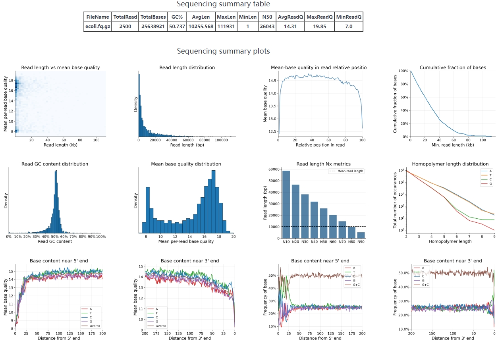

# Cycads

[](https://github.com/QYanwei/Cycads/actions/workflows/run_test.yml)

## Description

Cycads is a tool for quality control & error profile analysis of long-read sequencing data.

## Installation

```
git clone --depth 1 https://github.com/QYanwei/Cycads.git
conda env create --file Cycads/environment.yml --name cycads_env
conda activate cycads_env
cd cycads && pip install .
cycads --help
```


## Quick start

The example below generates HTML report from `test/ecoli.fq.gz`:

  ```
  cycads --fastq test/ecoli.fq.gz --output_dir test --sample_name fastq_output
  ```

## Usages

* FASTQ quality control
  ```
  cycads --fastq test/ecoli.fq.gz --output_dir test --sample_name fastq_output
  ```
* FASTQ filtering

  Should set the custom filtering parameter value by users
  ```
  cycads --fastq test/ecoli.fq.gz --filter --output_dir test --sample_name fastq_output
  ```
* FASTQ quality control and alignment-based error analysis
  ```
  cycads --fastq test/ecoli.fq.gz --reference test/ecoli.reference.fasta --output_dir test --sample_name alignment_output
  ```

* Alignment-based error analysis based on a pre-existing BAM file
  ```
  cycads --bam test/test.bam --output_dir test --sample_name bam_output
  ```


## Parameters details

  ```
                           === Cycads 0.4.0 ===
============================================================================
            Quality control & Data filtering & Error analysis
                            for Long-read sequencing
============================================================================

usage: cycads [-h] [-f FASTQ_PATH] [-b BAM_PATH] [-r REFERENCE_PATH] [-o OUTPUT_DIR] [-n SAMPLE_NAME] [-p PLATFORM] [-s N] [--seed SEED] [-T N] [-F] [-e N]
              [-Q MIN_BASE_QUALITY] [--min_length MIN_READ_LENGTH] [--max_length MAX_READ_LENGTH] [--trim_5_end N] [--trim_3_end N] [-d TARGET_DEPTH]
              [-g GENOME_SIZE] [--min_homopolymer_size MIN_HOMOPOLYMER_SIZE] [--max_homopolymer_size MAX_HOMOPOLYMER_SIZE]
              [--max_homopolymer_indel_size MAX_HOMOPOLYMER_INDEL_SIZE] [--alignment_threads THREADS] [--sort_threads THREADS] [--minimap2_arguments ARGUMENTS]
              [--minimap2 MINIMAP2] [--samtools SAMTOOLS] [--pyfastx PYFASTX]

A tool for quality control & error profile analysis of long-read sequencing data

options:
  -h, --help            show this help message and exit

I/O:
  Input/output arguments.

  -f FASTQ_PATH, --fastq FASTQ_PATH
                        Input FASTQ file. Supported extensions include *.fastq and *.fastq.gz. (default: None)
  -b BAM_PATH, --bam BAM_PATH
                        Input BAM file. (default: None)
  -r REFERENCE_PATH, --reference REFERENCE_PATH
                        Reference FASTA file. (default: None)
  -o OUTPUT_DIR, --output_dir OUTPUT_DIR
                        Output direcotry. (default: cycads_output)
  -n SAMPLE_NAME, --sample_name SAMPLE_NAME
                        Sample name displayed in output reports. (default: sample)
  -p PLATFORM, --platform PLATFORM
                        Design for CycloneSEQ data, also adopt to ONT and PB data. (default: cyclone)

FASTQ:
  Arguments for FASTQ analyses. Only effective when FASTQ_PATH is supplied.

  -s N, --sample N      Only include a random sample of N reads from the input FASTQ file to accelerate evaluation. (default: 10000)
  --seed SEED           Random seed for sampling. (default: 1)
  -T N, --check_terminal_bases N
                        Analyze N bases at both ends of each read. (default: 200)

Filtering:
  Arguments for filtering the input FASTQ file. Only effective when FASTQ_PATH is supplied.

  -F, --filter          Output filtered FASTQ file. Analyses are always based on the input FASTQ file. (default: False)
  -e N, --extract N     Randomly extract N reads from the input FASTQ file. (default: None)
  -Q MIN_BASE_QUALITY, --min_base_quality MIN_BASE_QUALITY
                        Remove reads with mean base quality less than MIN_BASE_QUALITY. (default: 7)
  --min_length MIN_READ_LENGTH
                        Remove reads shorter than MIN_READ_LENGTH. (default: 1)
  --max_length MAX_READ_LENGTH
                        Remove reads longer than MAX_READ_LENGTH. (default: 1000000000)
  --trim_5_end N        Trim N bases from the 5' end of each read. (default: 0)
  --trim_3_end N        Trim N bases from the 3' end of each read. (default: 0)
  -d TARGET_DEPTH, --target_depth TARGET_DEPTH
                        Downsample FASTQ file to TARGET_DEPTH. Requires GENOME_SIZE to be supplied. (default: None)
  -g GENOME_SIZE, --genome_size GENOME_SIZE
                        Genome size of sequenced sample. Required if TARGET_DEPTH is set. (default: None)

Homopolymers:
  Arguments related to homopolymer analyses.

  --min_homopolymer_size MIN_HOMOPOLYMER_SIZE
                        Do not analyze homopolymers shorter than MIN_HOMOPOLYMER_SIZE. (default: 2)
  --max_homopolymer_size MAX_HOMOPOLYMER_SIZE
                        Do not analyze homopolymers longer than MAX_HOMOPOLYMER_SIZE. (default: 9)
  --max_homopolymer_indel_size MAX_HOMOPOLYMER_INDEL_SIZE
                        Analyze homopolymer expansion/contraction up to MAX_HOMOPOLYMER_INDEL_SIZE. (default: 4)

Alignment:
  Arguments for read alignment. Only effective when FASTQ_PATH and REFERENCE_PATH are supplied.

  --alignment_threads THREADS
                        Number of threads used in read alignment. (default: 4)
  --sort_threads THREADS
                        Number of threads used in sorting aligned segments. (default: 1)
  --minimap2_arguments ARGUMENTS
                        Alignment arguments to be passed to minimap2. (default: -ax map-ont --secondary=no --MD --eqx -I 10G)

Dependencies:
  Arguments for custom paths to external binary dependencies. Cycads searches for binary dependencies in the following order: 1. arguments specified here; 2.
  the `dependencies` folder in Cycads installation path; 3. the system $PATH environmental variable.

  --minimap2 MINIMAP2   Path to Minimap2. (default: None)
  --samtools SAMTOOLS   Path to samtools. (default: None)
  --pyfastx PYFASTX     Path to pyfastx. (default: None)

  ```


## Example output

Result folder example:

  ```
  .
  ├── aligned_reads.bam
  ├── aligned_reads.bam.bai
  ├── bam.pickle
  ├── fastq_summary.txt
  ├── fq.pickle
  ├── HTML_report
  │   ├── query_all_error_item.barplot.png
  │   ├── query_all_substitution_errors.barplot.png
  │   ├── query_deletion_frequency.barplot.png
  │   ├── query_events_curve_idy.displot.png
  │   ├── query_homopolymer_length_event.lineplot.png
  │   ├── query_insertion_frequency.barplot.png
  │   ├── read_gc_histplot.barplot.png
  │   ├── read_head_base_content.lineplot.png
  │   ├── read_head_base_quality.lineplot.png
  │   ├── read_homopolymer_frequency.lineplot.png
  │   ├── read_length_biostat.barplot.png
  │   ├── read_length_cumulative.barplot.png
  │   ├── read_length_histplot_nolog.barplot.png
  │   ├── read_length_quality_cross.scatterplot.png
  │   ├── read_quality_histplot.barplot.png
  │   ├── read_relative_position_avg_qual.lineplot.png
  │   ├── read_tail_base_content.lineplot.png
  │   ├── read_tail_base_quality.lineplot.png
  │   └── summary.html
  ├── input.symlink.fastq.gz -> /path/to/test/ecoli.fq.gz
  └── input.symlink.fastq.gz.fxi

  1 directory, 26 files
  ```
Please donwload the **HTML_report** folder and open the **summary.html** to check the result with Web Browser, such as Google Chrome and so on.

## Report demo
* Sequencing summary



* Mapping summary


## Citation

https://github.com/QYanwei/Cycads


